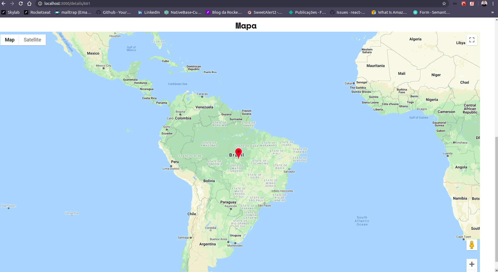

<p align="center">
   
</p>

<h1>Resultado</h1>

<p align="center">
   
</p>
<p align="center">
   
</p>
<p align="center">
   
</p>

<h1>Bônus</h1>
<p align="center">
   
</p>

Deploy:
<a href="https://inspiring-pike-9d0e9c.netlify.app/">Site<a>

# `Indice`

<a href="#Escopo">1. Escopo</a> <br />
<a href="#Tecnologias-utilizadas">2. Tecnologias utilizadas</a> <br />
<a href="#Como-baixar-e-executar-o-projeto">3. Como baixar e executar o projeto</a>

## Escopo

Este é um simples exemplo de como consumir a API da Marvel, consultar personagens da marvel e suas series relacionadas.

---

## Tecnologias utilizadas

O projeto foi desenvolvido utilizando as seguintes tecnologias:

- react: Por ser uma tecnologia que mais está crescendo e ganhado o mercado;

- axios: Utilizado para consumir a api, pois é simples de se usar;

- styled-components: Para colocar css no layout, também muito simples de utilizar;

- react-icons: Inclua ícones populares nos projetos do react facilmente com o react-icons;

- dotenv: Para cada desenvolvedor usar as suas credenciais de acesso, ou endereços diferente que existem em cada máquina;

- react-responsive-carousel: Para exibir uma coloções de series num formato bacana, fácil utilização dela também;

- react-router-dom: Para criar as routas do projeto;

- jest: Uma biblioteca também de fácil de aprender e começar a utilizar, precisamos deixar testado sempre o máximo possível necessário o projeto, para futura atualização em produção isso é sensacional. 

---
## Como baixar e executar o projeto


```bash

  # Clonar o repositório
  $ git clone https://github.com/DevTeles/Marvel.git

  # Entrar no diretório
  $ cd Marvel

  # Instalar as dependências
  $ yarn

  # Criar arquivo ".env" na raiz do projeto e preencher as variavéis de ambiente, que são as credenciais para acessar API da Marvel
  # Dúvida consultar link: (https://developer.marvel.com/docs)

  # Iniciar o projeto  
  $ yarn start

```

<br /><br />
Desenvolvido por **Rafael Teles Vital**
